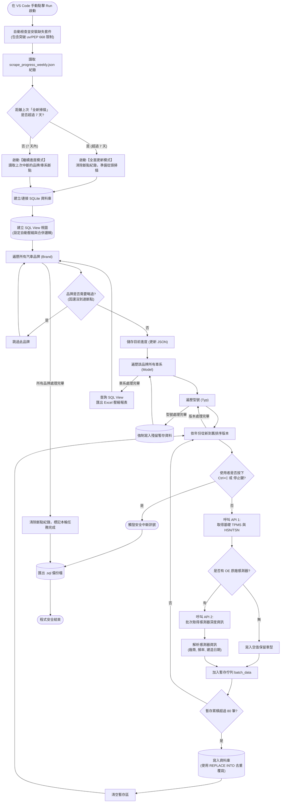

# 🚗 RDKS 胎壓感測器自動爬蟲系統 (每週自動更新本機版)

這是一個專為抓取、彙整汽車胎壓感測器（TPMS）資料所設計的全自動化爬蟲系統。此版本專為 **本機環境 (如 VS Code) 手動執行** 所打造，具備強大的環境適應力與中斷保護。

## ✨ 核心特色

1. **極致 SQL View 壓縮**：
   * 透過 SQL 原生的 `GROUP_CONCAT` 視圖，確保 **品牌、車系、型號** 相同的車款只會佔據一行 Excel。
   * 不同的感測器 (OE sensor)、頻率、HSN/TSN 會自動使用 `,` 逗號整齊串接，版面極度乾淨！
2. **深度 API 解析**：
   * 內建雙重 API 抓取。遇到隱藏的日期或頻率時，會自動解析 `gpsr/data` 接口補齊。
3. **無縫斷點接關與優雅中斷 (Graceful Shutdown)**：
   * 隨時可以在 VS Code 按下暫停 (Ctrl+C 或停止鍵)。程式會攔截中斷訊號，將暫存區的殘留資料安全寫入資料庫並匯出備份，達成「零資料遺失」。
   * 下次啟動時，精準從中斷的「車系型號」接續努力，完美銜接零浪費。
4. **七天自動大掃除**：
   * 內建七天週期檢查。只要距離上次完整抓取超過 7 天，按下啟動鍵時系統會自動失去記憶，進入「全面掃描模式」更新所有最新年份資料。（註：需使用者定期手動執行程式觸發此機制）。
5. **智能環境適應 (突破 PEP 668/uv 限制)**：
   * 執行時會自動檢查並安裝缺少的套件 (如 `requests`, `pandas`)。
   * 具備「三重突破機制」，即使在受保護的 Python 環境 (如 `uv` 管理的環境) 也能強制且安全地完成安裝，實現真正的一鍵啟動。

## 📁 檔案產出說明

執行完畢後，所有最新資料會自動儲存於 `胎壓資料庫_每週更新版/` 資料夾內，並依據汽車品牌分類為獨立的 Excel 報表。

## 詳細完整流程圖

🚗 RDKS 爬蟲系統運作流程圖 (完整架構版)

此版本詳實記錄了系統底層的每一道邏輯防線、迴圈控制與異常處理機制。

---
【簡化版流程圖 / 技術架構展示】

```mermaid

flowchart LR

    %% ==========================================
    %% 階段 1：啟動與防護
    %% ==========================================
    subgraph P1 ["① 啟動與環境自適應"]
        direction TB
        A1([系統手動啟動]) --> A2["自動安裝缺失套件\n(突破底層保護)"]
        A2 --> A3{"超過 7 天未更新?"}
        
        A3 -- 是 --> A4["【全面更新】\n清除舊斷點紀錄"]
        A3 -- 否 --> A5["【繼續進度】\n載入 JSON 斷點"]
    end

    %% ==========================================
    %% 階段 2：資料庫與導航
    %% ==========================================
    subgraph P2 ["② 智能導航與聚合設定"]
        direction TB
        B1[("連接 SQLite\n建立資料表")] --> B2[("建立 SQL View\n(設定合併與壓縮)")]
        B2 --> B3["展開全站品牌\n(過濾已完成)"]
        B3 --> B4["遍歷車系與型號\n(Model / Typ)"]
        B4 --> B5["依年份新到舊排序\n(Year)"]
    end

    %% ==========================================
    %% 階段 3：靜態 API 攔截
    %% ==========================================
    subgraph P3 ["③ 靜態 API 攔截與解析"]
        direction TB
        C1["呼叫 API 1\n(獲取 HSN / TSN)"] --> C2{"有 OE 原廠\n感測器?"}
        
        C2 -- 無 --> C3["寫入空值保留"]
        C2 -- 有 --> C4["呼叫 API 2\n(獲取深度規格)"]
        
        C3 --> C5
        C4 --> C5["解析 JSON 結構\n(廠商/頻率/日期)"]
        C5 --> C6["加入暫存佇列\n(batch_data)"]
    end

    %% ==========================================
    %% 階段 4：寫入與安全退出
    %% ==========================================
    subgraph P4 ["④ 無損寫入與安全防護"]
        direction TB
        D1{"遭遇中斷?\n(Ctrl+C / 暫停)"}
        
        D1 -- 否 (平穩運行) --> D2{"暫存滿 80 筆?"}
        D2 -- 是 --> D3[("寫入資料庫\n(REPLACE INTO)")]
        D2 -- 否 --> D4["累積數據，繼續抓取"]
        
        D1 -- 是 (觸發防護) --> D5[("強制寫入殘留\n保留當前斷點")]
        
        D3 --> D6["(該品牌全數完成時)\n透過 View 匯出 Excel"]
        
        D4 -.-> D6
        D5 --> D7[("匯出 .sql 備份檔")]
        D6 -- "(所有品牌完成)" --> D7
        D7 --> D8([程式安全退出])
    end

    %% ==========================================
    %% 跨區塊連線 (強制建立 1 -> 2 -> 3 -> 4 佈局)
    %% ==========================================
    A4 --> B1
    A5 --> B1
    
    B5 --> C1
    
    C6 --> D1

    %% ==========================================
    %% 顏色與樣式設定
    %% ==========================================
    classDef default fill:#f9f9f9,stroke:#333,stroke-width:1px;
    classDef redBox fill:#ffe6e6,stroke:#d32f2f,stroke-width:2px;
    classDef blueBox fill:#e3f2fd,stroke:#1976d2,stroke-width:2px;
    classDef greenBox fill:#e8f5e9,stroke:#388e3c,stroke-width:2px;
    classDef yellowDB fill:#fff8e1,stroke:#fbc02d,stroke-width:2px;
    classDef diamond stroke-dasharray: 5 5, fill:#fff;

    class A4,A5 redBox;
    class B3,B4,B5 blueBox;
    class C1,C4,C5 greenBox;
    class B1,B2,D3,D5,D7 yellowDB;
    class A3,C2,D1,D2 diamond;
```

